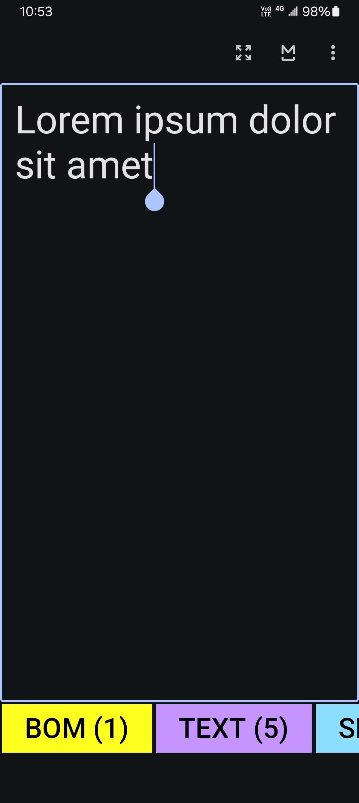
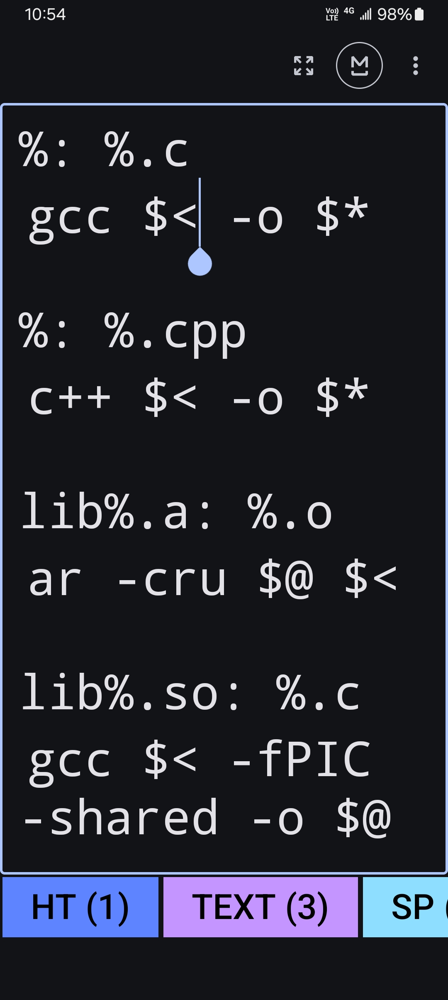

This is an app for showing invisible/unprintable characters on mobile. It can show characters like SP (space), HT (horizontal tab), NBSP (non-breaking space), ZWNBSP (zero-width non-breaking space), CR (carriage return), LF (linefeed), BOM (byte-order mark, i.e., ZWNBSP at the start of a file) and others. However, it doesn't do it in a traditional way, i.e., displaying them as a part of text. Instead, this app will display its analysis about those charcters, in a different part of the screen.

It also comes with an indentation tool, which can insert any number of spaces/tabs to the start of each selected line.

### Screenshots

### What this app can do

* Show some of the control characters and delete or replace them (e.g., replace tabs with spaces)

* Add or remove any number of spaces to or from the start of each selected line.

* Add or remove the BOM (byte-order mark)

* Count and show the number of letters in UTF-32

* Count and show the number of bytes in UTF-8

### What it currently cannot do

* Open a file. (Despite this app's name, such functionality is not yet implemented)

* Find and replace text. (Not yet implemented, and might not be implented)

### Usage

* Tapping on the button that looks like `M`, when it is circled, will turn off the monospace mode and the text will then become normal. Tapping on it again will turn on monospace mode and make all text monospaced. The circled M means monospace mode is on.

* When no text is selected, the app will show the analysis of the line where the cursor is

* Tapping on any of the colored block will give you options about what to do.

* When the text is too long, you should turn off the monospace mode and zoom out with gesture. But if the letters are too small, you should zoom in instead.

### Note

* This is not a game; just looks like. It is instead a very serious tool.

* This is under development. It has bugs.

* When you replace a character using this app, only the character or characters grouped together (represented as `CHAR (NUMBER)`, where `CHAR` is the character and `NUMBER` is the number of characters of that kind) will be replaced. The functionality of replacing it in the whole file is not implemented.

* The functionality of opening a file is not yet implemented. Just copy and paste the file content if you want to analyze it.